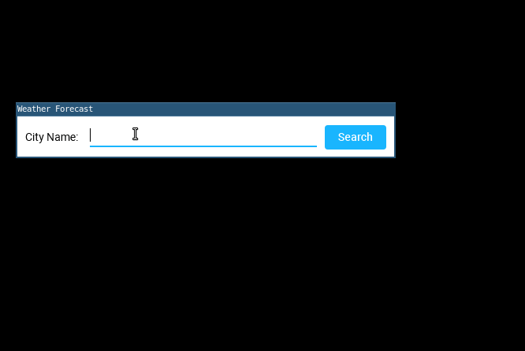

# Wheater Forecast

Simple weather forecast java app using [Open Weather API](https://openweathermap.org/api)

## Open Weather API

API is abbreviation from Application Programming Interface.
Basically, it allows interaction between two or more programs.
Usually, web programming using API for its endpoint, so other programs
may use/give information to/from the endpoint.

There are some api in Open Weather API,
but this program only use one API, the [16 day/daily API](https://openweathermap.org/forecast16).
Program will send GET request with city name to search, and get list of cities match with 7 day forecast.

## Package Structure

    weather-forecast/
    |__src
       |__com
          |__yonasadiel
             |__openwheaterapi
             |  |__OpenWeatherAPIConnection
             |  |__ResponseParser
             |__city
             |  |__listeners
             |  |  |__ [ listeners ... ]
             |  |  |__ ...
             |  |__views
             |  |  |__ [ views ... ]
             |  |  |__ ...
             |  |__City
             |  |__Coordinate
             |__weatherdata
             |  |__listeners
             |  |  |__ [ listeners ... ]
             |  |  |__ ...
             |  |__views
             |  |  |__ [ views ... ]
             |  |  |__ ...
             |  |__Condition
             |  |__Forecast
             |  |__Temperature
             |  |__Weather
             |  |__WeatherData
             |__WeatherForecast

The package use yonasadiel.com domain,
because in Java, package may be conflict with other programs,
so it is better to use our own domain to package naming,

The package divided to features not by layer [(ref)](https://dzone.com/articles/package-your-classes-feature),
for some benefits like higher modularity, easier code navigation,
higher level of abstraction, separates features and layers, and some more.

## Usage

This program works with IntelliJ IDEA and Maven. Below are description for Maven usage.

### Installing packages

    mvn package

### Compile & Run

    mvn exec:java -Dexec.mainClass="com.yonasadiel.WeatherForecast"

## Dependencies

[JDepend Result](jdepend.txt)

* [material-ui-swing:0.9.2.6](https://github.com/atarw/material-ui-swing)
* [java-dotenv:3.1.1](https://github.com/cdimascio/java-dotenv)
* json:20180130
* opencsv:4.0
* junit:4.12
